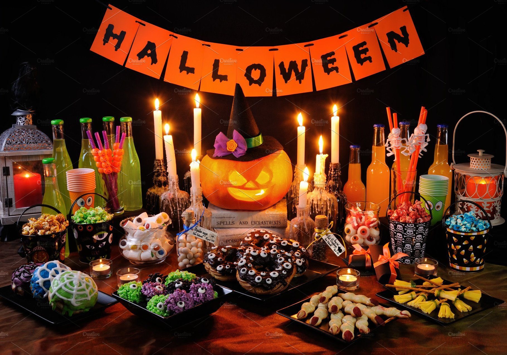

# Developing the new sweet for Halloween (in German)

### Situation: 

A fictional company wants to create a new product to become a bestseller during the Halloween season for which an analysis of the best-selling products was performed. 

### Model trained:

A stepwise linear regression was performed in order to discover which are the features of the sweets to be preferred over others.

### Metrics:

The R2 of the final model is 0.932, which means that the features of the model explain around 93% of the variability of the target variable.

### Results:

The main features that make a sweet be liked are: 

- Containing chocolate
- Having a fruity flavor
- Having a higher sugar percent
- Having a higher price percent
- Containing nuts, peanut butter or almonds
